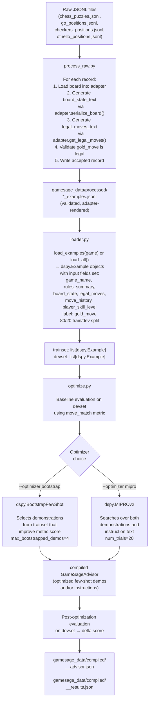
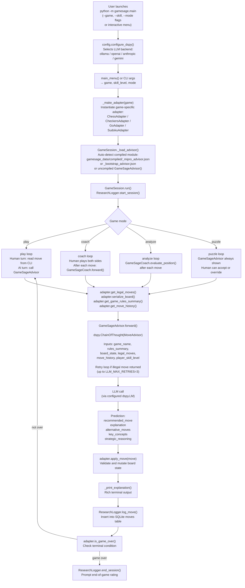

# GameSage Architecture

## Overview

GameSage is a DSPy-powered board game advisor that provides real-time AI coaching across multiple games: Chess, Checkers, Go, Othello, and Sudoku. The system has two distinct lifecycles that work in concert:

1. **Training pipeline** — an offline process that uses curated game positions to optimize DSPy prompt modules via few-shot demonstration selection (BootstrapFewShot) or full prompt search (MIPROv2). The result is a compiled JSON artifact.

2. **Play pipeline** — a real-time interactive loop in which a player makes moves through a terminal UI, and the compiled DSPy module drives skill-level-appropriate LLM advice, move recommendations, and post-move coaching.

The project is built on [DSPy](https://github.com/stanfordnlp/dspy), which lets the LLM backend be swapped at runtime (Ollama, OpenAI, Anthropic, Gemini) without touching application code. Research logging to SQLite is built in, capturing every session and move for later analysis.

---

## Directory Structure

```
dspy-game-box/
├── gamesage/                      # Main application package
│   ├── config.py                  # LLM backend selection, DSPy configuration, global settings
│   ├── main.py                    # Entry point — argument parsing, adapter instantiation, session start
│   │
│   ├── core/                      # Game-agnostic abstractions
│   │   ├── adapter.py             # GameAdapter abstract base class (the contract all games implement)
│   │   ├── explainer.py           # DSPy signatures and modules (GameSageAdvisor, GameSageCoach)
│   │   └── serializer.py         # Shared board-to-text formatting utilities
│   │
│   ├── games/                     # One sub-package per supported game
│   │   ├── chess/
│   │   │   ├── adapter.py         # ChessAdapter (implements GameAdapter, wraps ChessEngine)
│   │   │   ├── engine.py          # ChessEngine (thin wrapper around python-chess)
│   │   │   └── renderer.py        # Rich terminal board renderer
│   │   ├── checkers/
│   │   │   ├── adapter.py         # CheckersAdapter
│   │   │   ├── engine.py          # CheckersEngine (custom implementation)
│   │   │   └── renderer.py
│   │   ├── go/
│   │   │   ├── adapter.py         # GoAdapter (configurable board size)
│   │   │   ├── engine.py          # GoEngine (numpy-based)
│   │   │   └── renderer.py
│   │   ├── othello/
│   │   │   ├── adapter.py         # OthelloAdapter
│   │   │   ├── engine.py          # OthelloEngine
│   │   │   └── renderer.py
│   │   └── sudoku/
│   │       ├── adapter.py
│   │       ├── engine.py
│   │       └── renderer.py
│   │
│   ├── data/                      # Training pipeline modules
│   │   ├── process_raw.py         # Raw JSONL → validated, adapter-rendered processed JSONL
│   │   ├── loader.py              # Processed JSONL → dspy.Example objects (train/dev splits)
│   │   ├── metric.py              # Evaluation metrics: move_match, move_in_legal, combined
│   │   └── optimize.py            # DSPy optimizer runner (BootstrapFewShot or MIPROv2)
│   │
│   ├── ui/
│   │   └── cli.py                 # Rich-based CLI: main menu, GameSession, all game loop modes
│   │
│   └── research/
│       └── logger.py              # SQLite research logger (sessions, moves, ratings tables)
│
├── gamesage_data/                 # Data directory (not committed, created at runtime)
│   ├── chess_puzzles.jsonl        # Raw Lichess puzzle data
│   ├── go_positions.jsonl         # Raw SGF-derived Go positions
│   ├── checkers_positions.jsonl   # Raw PDN-derived checkers positions
│   ├── othello_positions.jsonl    # Raw Othello positions
│   ├── processed/
│   │   ├── chess_examples.jsonl   # Adapter-rendered, validated training examples
│   │   ├── go_examples.jsonl
│   │   ├── checkers_examples.jsonl
│   │   └── othello_examples.jsonl
│   └── compiled/
│       ├── chess_bootstrap_advisor.json   # Compiled DSPy module (few-shot demos)
│       ├── chess_mipro_advisor.json       # Compiled DSPy module (MIPROv2 optimized)
│       └── *_results.json                 # Optimization run metrics
│
└── gamesage_research.db           # SQLite research log (created at runtime)
```

---

## Major Components

### config.py — LLM Backend and Global Settings

Centralizes all runtime configuration. LLM backend is selected by the `GAMESAGE_LLM_BACKEND` environment variable (`ollama` by default; also `openai`, `anthropic`, `gemini`). The `configure_dspy()` function constructs the appropriate `dspy.LM` instance and registers it globally with `dspy.configure()`. A `--dry-run` mode injects a deterministic stub LM so the full pipeline can be exercised without any network calls.

Key settings: model names per backend, default skill level, Go board size, research logging toggle, SQLite path, LLM retry count.

### core/adapter.py — GameAdapter Abstract Base Class

Defines the contract that every game implementation must satisfy. The LLM pipeline only ever interacts with this interface — it never inspects engine internals directly. Required methods:

| Method | Purpose |
|---|---|
| `get_game_name()` | Human-readable name used in LLM prompts |
| `get_board_state()` | Structured dict: board, current_player, move_count, game_phase, extra |
| `get_legal_moves()` | List of legal moves in game-specific notation |
| `apply_move(move)` | Mutate state; returns True if legal |
| `undo_move()` | Revert last move |
| `is_game_over()` | `(bool, result_string)` tuple |
| `serialize_board()` | Plain-text board string injected into LLM prompts |
| `get_game_rules_summary()` | Short rules blurb injected into every LLM prompt |
| `get_move_history()` | Ordered list of moves played so far |

### core/explainer.py — DSPy Signatures and Modules

This is the LLM reasoning layer. It defines three DSPy signatures (structured I/O contracts) and two DSPy modules (prompt programs):

**Signatures:**
- `MoveAdvisor` — takes game context + board + legal moves + player skill level; outputs a recommended move, plain-English explanation, alternatives, and key concepts.
- `PositionEvaluator` — takes board state; outputs position summary, advantages, threats, suggested focus.
- `MoveExplainer` — takes board before/after + move played; outputs explanation, what it sets up, what it prevents.

**Modules:**
- `GameSageAdvisor` — wraps `MoveAdvisor` in a `dspy.ChainOfThought`. Includes retry logic: if the LLM returns an illegal move, it appends negative feedback to the prompt and retries up to `LLM_MAX_RETRIES` times, then falls back to a random legal move. Can be loaded from a compiled JSON file via `GameSageAdvisor.from_compiled(path)`.
- `GameSageCoach` — wraps `PositionEvaluator` and `MoveExplainer` in `dspy.Predict`. Used for post-move coaching commentary and standalone position analysis.

### core/serializer.py — Board Text Formatting

Shared utilities for converting board state into LLM-readable text. Provides `grid_to_text()` for 2-D grids with optional row/column labels and box-divider lines, `kv_block()` for key-value metadata blocks, and `format_move_history()` for compact numbered move history strings.

### games/{game}/adapter.py — Game Adapters

Each game sub-package contains an adapter that implements `GameAdapter` by delegating to the game's engine. Adapters are responsible for:
- Translating between human notation and engine representation
- Building the structured `board_state` dict
- Generating the LLM-readable `serialize_board()` string (includes FEN for chess, captures/komi for Go, piece counts for Checkers/Othello)
- Providing the game's `RULES_SUMMARY` constant, which is imported by the data loader to avoid adapter instantiation during training

Each adapter also exposes `is_move_legal(move)` as an optional helper that `GameSageAdvisor` can use as a `validate_move_fn` without mutating state.

**Move notation per game:**
- Chess: Standard Algebraic Notation (SAN) — `Nf3`, `exd5`, `O-O`, `e8=Q`
- Go: Column letter (A-T, I skipped) + row number — `D5`, `A1`
- Checkers: Row,col arrow pairs — `5,2→4,3` (multi-jump chains supported)
- Othello: Column letter (A-H) + row number — `H7`, `D3`

### games/{game}/engine.py — Game Engines

Pure game logic with no LLM awareness. Chess delegates entirely to `python-chess` (`chess.Board`). Other games have custom implementations. Engines expose: legal move generation, move application/undo, terminal condition detection, and ASCII board rendering.

### data/process_raw.py — Raw Data Processing

Converts raw JSONL source files (Lichess puzzles, SGF Go sequences, PDN checkers positions, Othello positions) into training-ready examples. For each raw record it:
1. Instantiates the appropriate game adapter
2. Loads the board position (FEN for chess, SGF replay for Go, PDN square mapping for checkers)
3. Calls `adapter.serialize_board()` and `adapter.get_legal_moves()` to generate `board_state_text` and `legal_moves_text`
4. Validates that the declared `gold_move` is actually legal
5. Writes accepted records to `gamesage_data/processed/<game>_examples.jsonl`

This step is a one-time offline operation run via `python -m gamesage.data.process_raw`.

### data/loader.py — Example Loader

Reads processed JSONL files and converts them to `dspy.Example` objects with `.with_inputs()` set to the six fields the `MoveAdvisor` signature expects. Provides:
- `load_examples(game)` — single game, 80/20 train/dev split
- `load_all()` — all four games combined
- `load_by_skill(game, skill_level)` — filtered to one skill tier
- `dataset_stats()` — summary printout of available data

Rules summaries are imported from adapter module-level constants (no adapter instantiation needed) and injected into examples at load time.

### data/metric.py — Evaluation Metrics

Three metrics for DSPy optimization:
- `move_match` (primary) — 1.0 if predicted move equals gold move after stripping check/mate suffixes
- `move_in_legal` — 1.0 if predicted move is anywhere in the legal move list (legality sanity check)
- `combined` — 0.8 × move_match + 0.2 × move_in_legal

### data/optimize.py — Optimizer Runner

CLI tool that runs the full optimization pipeline against a game's processed dataset. Supports:
- `BootstrapFewShot` (default, fast) — selects few-shot demonstrations from training examples that improve metric score
- `MIPROv2` (slower, stronger) — searches over both demonstrations and instruction text

Workflow: load data → baseline evaluation → compile → post-optimization evaluation → save compiled module + results JSON.

Compiled modules are saved to `gamesage_data/compiled/<game>_<optimizer>_advisor.json`.

### ui/cli.py — Terminal Interface

Rich-powered interactive CLI. `main_menu()` collects game, skill level, and mode from the user. `GameSession` encapsulates a single play session and supports four modes:

| Mode | Behavior |
|---|---|
| `play` | Human vs AI; human picks a color, AI plays the other side using `GameSageAdvisor` |
| `coach` | Human plays both sides; after each move `GameSageCoach` provides post-move analysis |
| `analyze` | Continuous position evaluation using `GameSageCoach.evaluate_position()` |
| `puzzle` | AI always shows a hint; human can accept or override it |

In-session commands available to the player: `hint`, `explain`, `eval`, `undo`, `moves`, `notation` (chess only), `quit`.

On startup, `GameSession._load_advisor()` automatically looks for a compiled module in `gamesage_data/compiled/`, preferring MIPROv2 over BootstrapFewShot if both exist, and falls back to an uncompiled `GameSageAdvisor()` if none is found.

### research/logger.py — Research Logger

SQLite-backed logger that records every session and move. Three tables:
- `sessions` — game, skill level, mode, start/end timestamps
- `moves` — player, move played, board state before, LLM recommended move, LLM explanation, LLM reasoning, whether advice was followed, time taken
- `ratings` — optional per-session user ratings (clarity, helpfulness, free-text comments)

The logger is a context manager; `main.py` wraps the entire `GameSession` in `with ResearchLogger()`. Logging can be disabled via the `GAMESAGE_RESEARCH_LOGGING=false` environment variable.

---

## Training Pipeline

The training pipeline is a one-time offline process that produces a compiled DSPy module. It does not require a running game session.



**To run the training pipeline:**
```bash
# Process raw data (one-time)
python -m gamesage.data.process_raw

# Optimize with BootstrapFewShot (fast)
python -m gamesage.data.optimize --game chess --optimizer bootstrap

# Optimize with MIPROv2 (stronger)
python -m gamesage.data.optimize --game chess --optimizer mipro

# Dry run (validates pipeline without LLM calls)
python -m gamesage.data.optimize --dry-run
```

---

## Play Pipeline

The play pipeline is the real-time interactive session driven by `gamesage/main.py`.



**Inline commands** (available at any move prompt during a session):

| Command | Action |
|---|---|
| `hint` | Call `GameSageAdvisor` and display recommendation |
| `explain` | Call `GameSageCoach.explain_move()` on the last move |
| `eval` | Call `GameSageCoach.evaluate_position()` on current board |
| `undo` | Call `adapter.undo_move()` |
| `moves` | Print all legal moves |
| `notation` | Print SAN reference guide (chess only) |
| `quit` / `q` | End session |

---

## How the Two Pipelines Interact

The training and play pipelines are decoupled by a single artifact: the compiled DSPy module JSON file.

```
Training pipeline                       Play pipeline
─────────────────                       ─────────────
process_raw.py                          main.py
  │                                       │
  ▼                                       ▼
processed JSONL                         GameSession._load_advisor()
  │                                       │
  ▼                                       │  looks for:
loader.py → dspy.Example objects         │  gamesage_data/compiled/
  │                                       │    <game>_mipro_advisor.json
  ▼                                       │    <game>_bootstrap_advisor.json
optimize.py                              │
  │                                       │
  ▼                                       ▼
gamesage_data/compiled/         GameSageAdvisor.from_compiled(path)
  <game>_<opt>_advisor.json  ──────────►   .load(path)   (DSPy built-in)
                                           │
                                           ▼
                                      compiled module with
                                      optimized few-shot demos
                                      and/or instruction text
                                           │
                                           ▼
                                      GameSageAdvisor.forward()
                                      → higher-quality LLM advice
```

The key mechanism: `GameSageAdvisor` is a standard `dspy.Module`. DSPy's `.save()` / `.load()` methods serialize and restore the module's internal state — primarily the few-shot demonstrations selected by BootstrapFewShot, or the instruction text and demonstrations found by MIPROv2. When the play session loads a compiled module, the LLM receives better-contextualized prompts with concrete examples of correct move recommendations, which improves the quality of advice it gives to the player without changing any application code.

If no compiled module exists for the active game, `GameSession._load_advisor()` silently falls back to an uncompiled `GameSageAdvisor()`, so the system remains fully functional — just without the optimization benefit.

**Optimization preference order:** MIPROv2 is preferred over BootstrapFewShot when both exist for the same game, since it performs a broader search over the prompt space. Within the same optimizer, per-game compiled modules are used (e.g., `chess_mipro_advisor.json` when playing Chess).

**The metric that drives optimization** (`move_match`) directly reflects play quality: it scores 1.0 only when the model recommends the exact move that a strong player would choose in the training position. This means the compiled module is specifically tuned to recommend strong moves, not just legal ones.

---

## LLM Backend Configuration

Configure via environment variables before launching either pipeline:

| Variable | Default | Options |
|---|---|---|
| `GAMESAGE_LLM_BACKEND` | `ollama` | `ollama`, `openai`, `anthropic`, `gemini` |
| `GAMESAGE_OLLAMA_MODEL` | `llama3.1` | any Ollama model name |
| `GAMESAGE_OLLAMA_BASE_URL` | `http://localhost:11434` | Ollama server URL |
| `GAMESAGE_OPENAI_MODEL` | `gpt-4o` | any OpenAI model |
| `GAMESAGE_ANTHROPIC_MODEL` | `claude-sonnet-4-6` | any Anthropic model |
| `GAMESAGE_GEMINI_MODEL` | `gemini/gemini-2.0-flash` | any Gemini model |
| `GAMESAGE_SKILL_LEVEL` | `beginner` | `beginner`, `intermediate`, `advanced` |
| `GAMESAGE_GO_BOARD_SIZE` | `9` | `9`, `13`, `19` |
| `GAMESAGE_RESEARCH_LOGGING` | `true` | `true`, `false` |
| `GAMESAGE_DB_PATH` | `gamesage_research.db` | any file path |

API keys are read from `OPENAI_API_KEY`, `ANTHROPIC_API_KEY`, and `GEMINI_API_KEY` respectively. Ollama requires no key.
